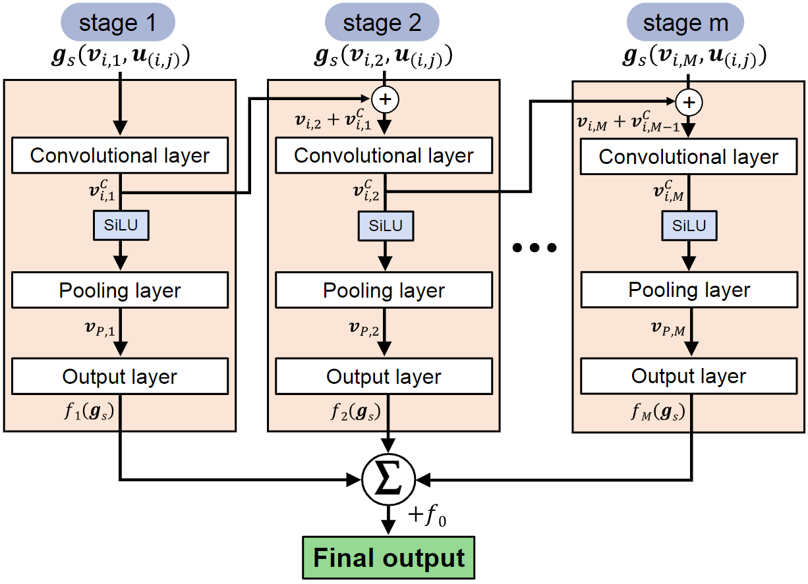

# boosting-CGCNN

Implementation codes for Boosting-Crystal Graph Convolutional Neural Network (Boosting-CGCNN) [Link](https://pubs.acs.org/doi/10.1021/acsami.4c07851).


<p align="center">
  
</p>

## Installation

1. Make a conda environment

```
conda create -n gb python=3.9
conda activate gb
```

2. Install dependencies
```
git clone https://github.com/sunilegna/GB-CGCNN.git
pip install poetry
poetry install
```

3. Training code
```
python main.py
```

## How to Cite

If you use this code, please reference the following paper:

1. Eun Ho Kim, Jun Hyeong Gu, June Ho Lee, Seong Hun Kim, Jaeseon Kim, Hyo Gyeong Shin, Shin Hyun Kim, Donghwa Lee. *Boosting–crystal graph convolutional neural network for predicting highly imbalanced data: a case study for metal-insulator transition materials*. ACS Appl. Mater. Interfaces, 16(33), 43734-43741 (2024). [https://pubs.acs.org/doi/10.1021/acsami.4c07851](https://pubs.acs.org/doi/10.1021/acsami.4c07851)

